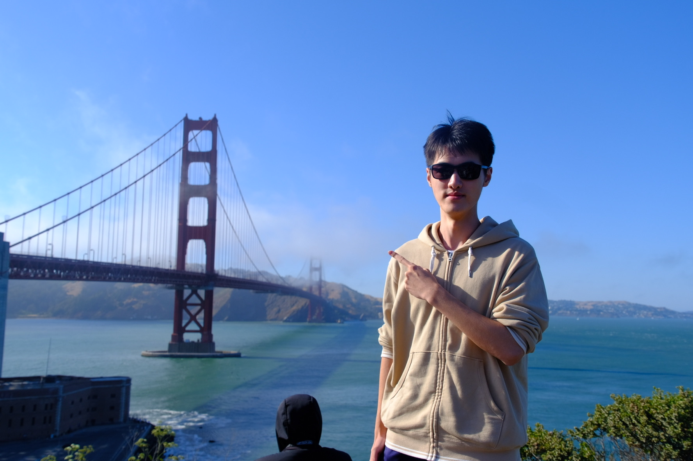
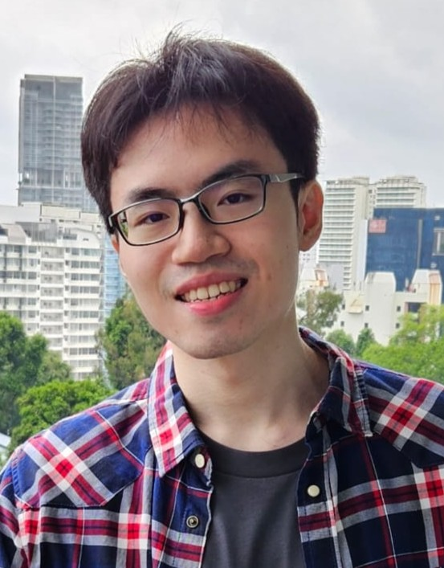

We are a team based in the [School of Computing, National University of Singapore](https://www.comp.nus.edu.sg).

You can reach us at the email `seer[at]comp.nus.edu.sg`

## Project team

### Roy Tay

[[github](https://github.com/themintchoco)]

* Role: Team Lead
* Responsibilities: Git expert, Integration

### Chen Jiahao

[[github](https://github.com/Neilchen863)]

* Role: developer
* Responsibilities: Testing, Documentation

### Lam Yu Han Bryan

[[github](http://github.com/sociallyineptweeb)]

* Role: Developer
* Responsibilities: Deliverables and deadlines, Scheduling and tracking

### Lee Zhan Hong

[[github](https://github.com/Zhannyhong)]

* Role: Developer
* Responsibilities: IntelliJ expert, Code quality

