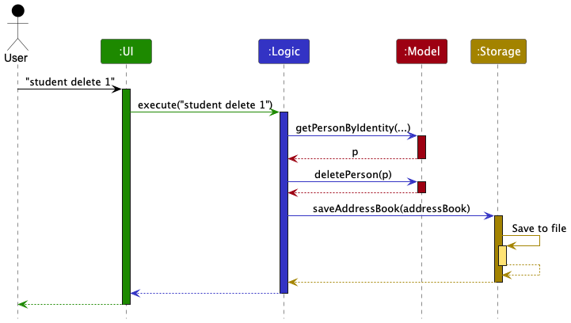
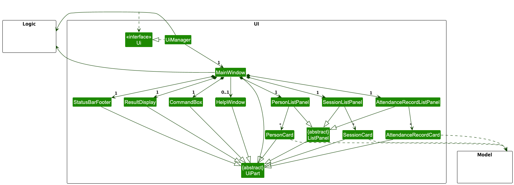
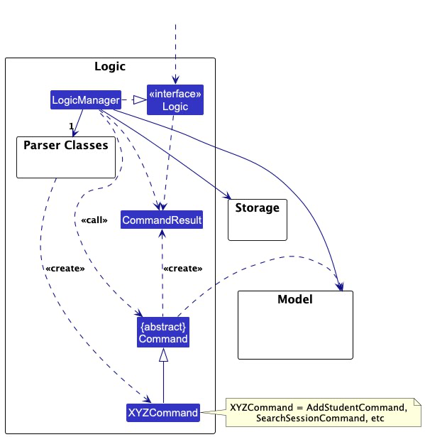
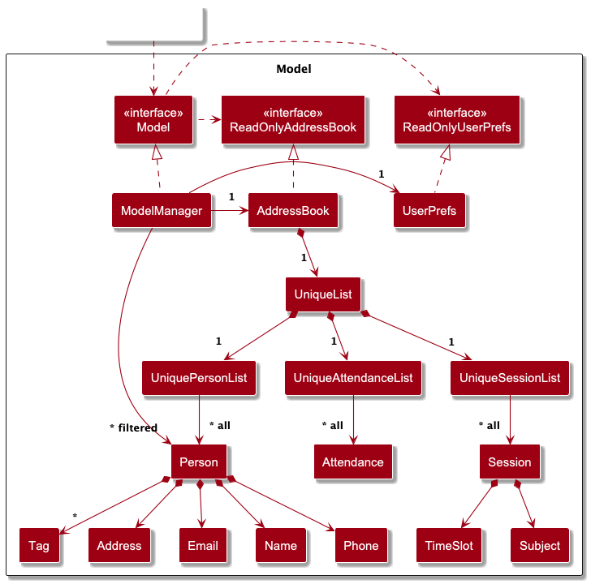
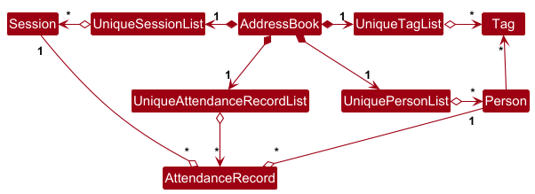
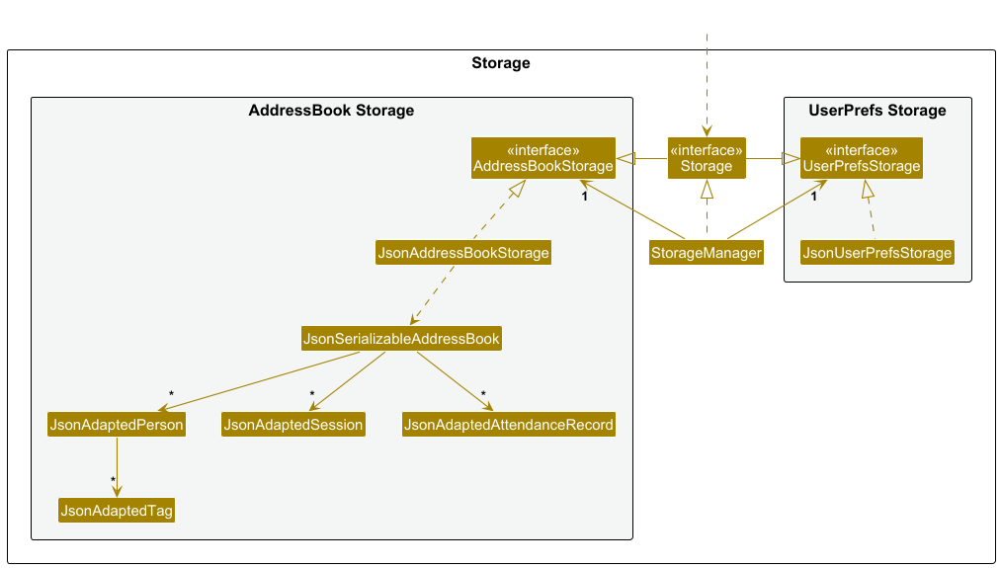

* Table of Contents
{:toc}

--------------------------------------------------------------------------------------------------------------------

## **Acknowledgements**

* {list here sources of all reused/adapted ideas, code, documentation, and third-party libraries -- include links to the original source as well}

--------------------------------------------------------------------------------------------------------------------

## **Setting up, getting started**

Refer to the guide [_Setting up and getting started_](SettingUp.md).

--------------------------------------------------------------------------------------------------------------------

## **Design**

:bulb: **Tip:** The `.puml` files used to create diagrams in this document `docs/diagrams` folder. Refer to the [_PlantUML Tutorial_ at se-edu/guides](https://se-education.org/guides/tutorials/plantUml.html) to learn how to create and edit diagrams.

### Architecture

The ***Architecture Diagram*** given above explains the high-level design of the App.

Given below is a quick overview of main components and how they interact with each other.

**Main components of the architecture**

**`Main`** (consisting of classes [`Main`](https://github.com/AY2425S2-CS2103T-T17-3/tp/tree/master/src/main/java/tutorly/Main.java) and [`MainApp`](https://github.com/AY2425S2-CS2103T-T17-3/tp/tree/master/src/main/java/tutorly/MainApp.java)) is in charge of the app launch and shut down.
* At app launch, it initializes the other components in the correct sequence, and connects them up with each other.
* At shut down, it shuts down the other components and invokes cleanup methods where necessary.

The bulk of the app's work is done by the following four components:

* [**`UI`**](#ui-component): The UI of the App.
* [**`Logic`**](#logic-component): The command executor.
* [**`Model`**](#model-component): Holds the data of the App in memory.
* [**`Storage`**](#storage-component): Reads data from, and writes data to, the hard disk.

[**`Commons`**](#common-classes) represents a collection of classes used by multiple other components.

**How the architecture components interact with each other**

The *Sequence Diagram* below shows how the components interact with each other for the scenario where the user issues the command `student delete 1`.

Each of the four main components (also shown in the diagram above),

* defines its *API* in an `interface` with the same name as the Component.
* implements its functionality using a concrete `{Component Name}Manager` class (which follows the corresponding API `interface` mentioned in the previous point.

For example, the `Logic` component defines its API in the `Logic.java` interface and implements its functionality using the `LogicManager.java` class which follows the `Logic` interface. Other components interact with a given component through its interface rather than the concrete class (reason: to prevent outside component's being coupled to the implementation of a component), as illustrated in the (partial) class diagram below.

The sections below give more details of each component.

### UI component

The **API** of this component is specified in [`Ui.java`](https://github.com/AY2425S2-CS2103T-T17-3/tp/tree/master/src/main/java/tutorly/ui/Ui.java)

The UI consists of a `MainWindow` that is made up of parts e.g.`CommandBox`, `ResultDisplay`, `PersonListPanel`, `StatusBarFooter` etc. The classes `PersonListPanel`, `SessionListPanel`, and `AttendanceRecordListPanel` inherit from the abstract `ListPanel` class which captures the commonalities of a panel in the GUI that displays a list of items. Each item in the list is represented as a card (e.g. `SessionCard`). All these, including the `MainWindow` and `ListPanel`, inherit from the abstract `UiPart` class which captures the commonalities between classes that represent parts of the visible GUI.

The `UI` component uses the JavaFx UI framework. The layout of these UI parts are defined in matching `.fxml` files that are in the `src/main/resources/view` folder. For example, the layout of the [`MainWindow`](https://github.com/AY2425S2-CS2103T-T17-3/tp/tree/master/src/main/java/tutorly/ui/MainWindow.java) is specified in [`MainWindow.fxml`](https://github.com/AY2425S2-CS2103T-T17-3/tp/tree/master/src/main/resources/view/MainWindow.fxml)

The `UI` component,

* executes user commands using the `Logic` component.
* listens for changes to `Model` data so that the UI can be updated with the modified data.
* keeps a reference to the `Logic` component, because the `UI` relies on the `Logic` to execute commands.
* depends on some classes in the `Model` component, as it displays `Person`, `Session`, and `AttendanceRecord` objects residing in the `Model`.

### Logic component

**API** : [`Logic.java`](https://github.com/AY2425S2-CS2103T-T17-3/tp/tree/master/src/main/java/tutorly/logic/Logic.java)

Here's a (partial) class diagram of the `Logic` component:

The sequence diagram below illustrates the interactions within the `Logic` component, taking `execute("delete 1")` API call as an example.

:information_source: **Note:** The lifeline for `DeleteCommandParser` should end at the destroy marker (X) but due to a limitation of PlantUML, the lifeline continues till the end of diagram.

How the `Logic` component works:

1. When `Logic` is called upon to execute a command, it is passed to an `AddressBookParser` object which in turn creates a parser that matches the command (e.g., `DeleteCommandParser`) and uses it to parse the command.
1. This results in a `Command` object (more precisely, an object of one of its subclasses e.g., `DeleteCommand`) which is executed by the `LogicManager`.
1. The command can communicate with the `Model` when it is executed (e.g. to delete a person). 
   Note that although this is shown as a single step in the diagram above (for simplicity), in the code it can take several interactions (between the command object and the `Model`) to achieve.
1. The result of the command execution is encapsulated as a `CommandResult` object which is returned back from `Logic`.

Here are the other classes in `Logic` (omitted from the class diagram above) that are used for parsing a user command:

How the parsing works:
* When called upon to parse a user command, the `AddressBookParser` class creates an `XYZCommandParser` (`XYZ` is a placeholder for the specific command name e.g., `AddCommandParser`) which uses the other classes shown above to parse the user command and create a `XYZCommand` object (e.g., `AddCommand`) which the `AddressBookParser` returns back as a `Command` object.
* All `XYZCommandParser` classes (e.g., `AddCommandParser`, `DeleteCommandParser`, ...) inherit from the `Parser` interface so that they can be treated similarly where possible e.g, during testing.

### Model component
**API** : [`Model.java`](https://github.com/AY2425S2-CS2103T-T17-3/tp/tree/master/src/main/java/tutorly/model/Model.java)

The `Model` component,

* stores the address book data i.e., all `Person` objects (which are contained in a `UniquePersonList` object).
* stores the currently 'selected' `Person` objects (e.g., results of a search query) as a separate _filtered_ list which is exposed to outsiders as an unmodifiable `ObservableList<Person>` that can be 'observed' e.g. the UI can be bound to this list so that the UI automatically updates when the data in the list change.
* stores a `UserPref` object that represents the user’s preferences. This is exposed to the outside as a `ReadOnlyUserPref` objects.
* does not depend on any of the other three components (as the `Model` represents data entities of the domain, they should make sense on their own without depending on other components)

:information_source: **Note:** An alternative (arguably, a more OOP) model is given below. It has a `Tag` list in the `AddressBook`, which `Person` references. This allows `AddressBook` to only require one `Tag` object per unique tag, instead of each `Person` needing their own `Tag` objects. 

### Storage component

**API** : [`Storage.java`](https://github.com/AY2425S2-CS2103T-T17-3/tp/tree/master/src/main/java/tutorly/storage/Storage.java)

The `Storage` component,
* can save both address book data and user preference data in JSON format, and read them back into corresponding objects.
* inherits from both `AddressBookStorage` and `UserPrefStorage`, which means it can be treated as either one (if only the functionality of only one is needed).
* depends on some classes in the `Model` component (because the `Storage` component's job is to save/retrieve objects that belong to the `Model`)

### Common classes

Classes used by multiple components are in the `tutorly.commons` package.

--------------------------------------------------------------------------------------------------------------------

## **Implementation**

This section describes some noteworthy details on how certain features are implemented.

### \[Proposed\] Undo/redo feature

#### Proposed Implementation

The proposed undo/redo mechanism is facilitated by `VersionedAddressBook`. It extends `AddressBook` with an undo/redo history, stored internally as an `addressBookStateList` and `currentStatePointer`. Additionally, it implements the following operations:

* `VersionedAddressBook#commit()` — Saves the current address book state in its history.
* `VersionedAddressBook#undo()` — Restores the previous address book state from its history.
* `VersionedAddressBook#redo()` — Restores a previously undone address book state from its history.

These operations are exposed in the `Model` interface as `Model#commitAddressBook()`, `Model#undoAddressBook()` and `Model#redoAddressBook()` respectively.

Given below is an example usage scenario and how the undo/redo mechanism behaves at each step.

Step 1. The user launches the application for the first time. The `VersionedAddressBook` will be initialized with the initial address book state, and the `currentStatePointer` pointing to that single address book state.

Step 2. The user executes `delete 5` command to delete the 5th person in the address book. The `delete` command calls `Model#commitAddressBook()`, causing the modified state of the address book after the `delete 5` command executes to be saved in the `addressBookStateList`, and the `currentStatePointer` is shifted to the newly inserted address book state.

Step 3. The user executes `add n/David …​` to add a new person. The `add` command also calls `Model#commitAddressBook()`, causing another modified address book state to be saved into the `addressBookStateList`.

:information_source: **Note:** If a command fails its execution, it will not call `Model#commitAddressBook()`, so the address book state will not be saved into the `addressBookStateList`.

Step 4. The user now decides that adding the person was a mistake, and decides to undo that action by executing the `undo` command. The `undo` command will call `Model#undoAddressBook()`, which will shift the `currentStatePointer` once to the left, pointing it to the previous address book state, and restores the address book to that state.

:information_source: **Note:** If the `currentStatePointer` is at index 0, pointing to the initial AddressBook state, then there are no previous AddressBook states to restore. The `undo` command uses `Model#canUndoAddressBook()` to check if this is the case. If so, it will return an error to the user rather
than attempting to perform the undo.

The following sequence diagram shows how an undo operation goes through the `Logic` component:

:information_source: **Note:** The lifeline for `UndoCommand` should end at the destroy marker (X) but due to a limitation of PlantUML, the lifeline reaches the end of diagram.

Similarly, how an undo operation goes through the `Model` component is shown below:

The `redo` command does the opposite — it calls `Model#redoAddressBook()`, which shifts the `currentStatePointer` once to the right, pointing to the previously undone state, and restores the address book to that state.

:information_source: **Note:** If the `currentStatePointer` is at index `addressBookStateList.size() - 1`, pointing to the latest address book state, then there are no undone AddressBook states to restore. The `redo` command uses `Model#canRedoAddressBook()` to check if this is the case. If so, it will return an error to the user rather than attempting to perform the redo.

Step 5. The user then decides to execute the command `list`. Commands that do not modify the address book, such as `list`, will usually not call `Model#commitAddressBook()`, `Model#undoAddressBook()` or `Model#redoAddressBook()`. Thus, the `addressBookStateList` remains unchanged.

Step 6. The user executes `clear`, which calls `Model#commitAddressBook()`. Since the `currentStatePointer` is not pointing at the end of the `addressBookStateList`, all address book states after the `currentStatePointer` will be purged. Reason: It no longer makes sense to redo the `add n/David …​` command. This is the behavior that most modern desktop applications follow.

The following activity diagram summarizes what happens when a user executes a new command:

#### Design considerations:

**Aspect: How undo & redo executes:**

* **Alternative 1 (current choice):** Saves the entire address book.
  * Pros: Easy to implement.
  * Cons: May have performance issues in terms of memory usage.

* **Alternative 2:** Individual command knows how to undo/redo by
  itself.
  * Pros: Will use less memory (e.g. for `delete`, just save the person being deleted).
  * Cons: We must ensure that the implementation of each individual command are correct.

_{more aspects and alternatives to be added}_

### \[Proposed\] Data archiving

_{Explain here how the data archiving feature will be implemented}_

--------------------------------------------------------------------------------------------------------------------

## **Documentation, logging, testing, configuration, dev-ops**

* [Documentation guide](Documentation.md)
* [Testing guide](Testing.md)
* [Logging guide](Logging.md)
* [Configuration guide](Configuration.md)
* [DevOps guide](DevOps.md)

--------------------------------------------------------------------------------------------------------------------

## **Appendix: Requirements**

### Product scope

**Target user profile**:

* private tutor
* need to track large number of students' details and sessions
* prefer desktop apps over other types
* can type fast
* prefers typing to mouse interactions
* is reasonably comfortable using CLI apps

**Value proposition**: tracks and manages students’ details faster than a typical mouse/GUI driven app,
reducing manual effort and ensuring better organization.

### User stories

Priorities: High (must have) - `* * *`, Medium (nice to have) - `* *`, Low (unlikely to have) - `*`

| Priority | As a …​                           | I want to …​                                         | So that I can…​                                                                   |
|----------|-----------------------------------|------------------------------------------------------|-----------------------------------------------------------------------------------|
| `* * *`  | new user                          | see usage instructions                               | refer to instructions when I forget how to use the app                            |
| `* * *`  | user                              | add a new student with basic details                 | begin tracking their progress                                                     |
| `* * *`  | user                              | log past lesson notes for a student                  | recall what was previously covered                                                |
| `* * *`  | user with many students           | search a student by name                             | quickly find their details before a session without going through the entire list |
| `* * *`  | user                              | edit student records                                 | update student details when they change                                           |
| `* * *`  | long-time user                    | archive or delete old student records                | stop tracking students that I no longer teach                                     |
| `* * *`  | user                              | mark a session as completed and record attendance    | track my classes                                                                  |
| `* *`    | potential user                    | see the app populated with sample data initially     | easily visualise how it will look like in real use                                |
| `* *`    | user ready to start using the app | delete all sample data                               | start fresh with my actual students                                               |
| `* *`    | user with many students           | sort students by any field                           | locate a student easily                                                           |
| `* *`    | user                              | log lesson details and assign homework               | keep track of progress and tasks                                                  |
| `* *`    | user                              | search lesson notes by keywords                      | quickly find when a topic was last covered                                        |
| `* *`    | user                              | create custom tags for students                      | categorise them based on needs                                                    |
| `* *`    | user                              | filter students by custom tags                       | see all students with particular needs                                            |
| `* *`    | returning user                    | quickly resume by accessing archived student records | pick up where I left off                                                          |
| `*`      | expert user                       | bulk-edit lesson notes or assignments                | save time by updating multiple records at once                                    |
| `*`      | user teaching multiple subjects   | customise tracking fields for different subjects     | tailor my records to different teaching needs                                     |
| `*`      | user teaching group classes       | create group sessions with multiple students         | track their progress collectively as a class                                      |
| `*`      | user                              | generate a progress report for a student             | share updates with parents                                                        |
| `*`      | user                              | receive a weekly summary of my sessions              | review my workload                                                                |
| `*`      | user                              | set reminder for upcoming sessions                   | remember upcoming lessons                                                         |
| `*`      | user                              | view reminders for upcoming sessions                 | plan my schedule                                                                  |
| `*`      | user                              | hide private contact details                         | minimise chance of someone else seeing them by accident                           |

### Use Cases

(For all use cases below, the **System** is `Tutorly`, and the **Actor** is the `tutor`, unless specified otherwise.)

---

**Use case: Add a student record**

**MSS**

1. Tutor requests to add a new student.
2. Tutorly prompts for student details (Name, Phone, Email, Address, Tag, Memo).
3. Tutor provides the required information.
4. Tutorly validates the input.
5. Tutorly adds the student profile to the database and confirms success.

   Use case ends.

**Extensions**

- 3a. Tutor provides invalid input for any field.
    - 3a1. Tutorly displays an appropriate error message.
    - 3a2. Tutor corrects the input.
    - Use case resumes at step 4.

- 4a. The student already exists (Same Name).
    - 4a1. Tutorly displays an error message: “Student already exists.”
    - Use case ends.

- 4b. Tutor does not provide all required fields.
    - 4b1. Tutorly prompts for the missing information.
    - Use case resumes at step 3.

---

**Use case: Search for a student record**

**MSS**

1. Tutor requests to search for a student by entering a query.
2. Tutorly validates the search query.
3. Tutorly retrieves and displays matching student profiles.

   Use case ends.

**Extensions**

- 2a. The search query is empty.
    - 2a1. Tutorly displays an error message: “Search query cannot be empty.”
    - Use case ends.

- 3a. No students match the search query.
    - 3a1. Tutorly displays: “No student found matching the query.”
    - Use case ends.

---

**Use case: Update a student record**

**MSS**

1. Tutor requests to update a student record by providing the student’s Identifier.
2. Tutorly retrieves the student’s existing profile.
3. Tutor provides updated details (e.g., Name, Phone, Email, Address, Tag, Memo).
4. Tutorly validates the input.
5. Tutorly updates the student profile and confirms success.

   Use case ends.

**Extensions**

- 2a. The student Identifier does not exist.
    - 2a1. Tutorly displays an error message: “Invalid student Identifier.”
    - Use case ends.

- 3a. Tutor does not provide any update parameters.
    - 3a1. Tutorly displays an error message: “No update provided.”
    - Use case ends.

- 4a. Tutor provides invalid input for any field.
    - 4a1. Tutorly displays an appropriate error message.
    - 4a2. Tutor corrects the input.
    - Use case resumes at step 5.

---

**Use case: Delete a student record**

**MSS**

1. Tutor requests to delete a student record by providing the student’s Identifier..
2. Tutorly retrieves the student record.
3. Tutorly validates the request and performs the action.
4. Tutorly confirms the success of the operation.

   Use case ends.

**Extensions**

- 2a. The student Identifier does not exist.
    - 2a1. Tutorly displays an error message: “Student record not found.”
    - Use case ends.

---

**Use case: Mark attendance for a tutoring session**

**MSS**

1. Tutor requests to mark a session as attended by providing the student’s ID, Session ID, and attendance status.
2. Tutorly validates the input.
3. Tutorly logs the attendance.
4. Tutorly confirms success.

   Use case ends.
   
---

**Use case: Add a Session**

**MSS**

1. Tutor requests to add a new session.
2. Tutorly prompts for session details (Timeslot, Subject).
3. Tutor provides the required information.
4. Tutorly validates the input.
5. Tutorly adds the session to the database and confirms success.

   Use case ends.

**Extensions**

- 3a. Tutor provides invalid input for any field.
    - 3a1. Tutorly displays an appropriate error message.
    - 3a2. Tutor corrects the input.
    - Use case resumes at step 4.

- 4a. The timeslot overlaps with another existing session.
    - 4a1. Tutorly displays an error message: “Session clashes with another session.”
    - Use case ends.

- 4b. Tutor does not provide all required fields.
    - 4b1. Tutorly prompts for the missing information.
    - Use case resumes at step 3.

---

**Use case: Enrol a student to a session**

**MSS**

1. Tutor requests to enrol a new student to an existing session.
2. Tutorly prompts for student and session details (Student Identifier, Session ID).
3. Tutor provides the required information.
4. Tutorly validates the input.
5. Tutorly adds the student profile to the session and confirms success.

   Use case ends.

**Extensions**

- 3a. Tutor provides invalid input for any field.
    - 3a1. Tutorly displays an appropriate error message.
    - 3a2. Tutor corrects the input.
    - Use case resumes at step 4.

- 4a. The student already exists in the session (Same Name).
    - 4a1. Tutorly displays an error message: “Student already exists in session.”
    - Use case ends.

- 4b. The student Identifier does not exist.
    - 4b1. Tutorly displays an error message: “Student record not found.”
    - Use case ends.

- 4c. The session does not exist.
    - 4c1. Tutorly displays an error message: “Session not found.”
    - Use case ends.

- 4d. Tutor does not provide all required fields.
    - 4d1. Tutorly prompts for the missing information.
    - Use case resumes at step 3.

**Extensions**

- 2a. The student ID does not exist.
    - 2a1. Tutorly displays an error message: “Invalid student ID.”
    - Use case ends.

- 2b. The Session ID does not exist.
    - 2b1. Tutorly displays an error message: “Invalid Session ID”
    - Use case ends.

- 3a. A session and student is already marked.
    - 3a1. Tutorly displays an erorr message: "Student is already marked present"
    - Use case ends.

### Non-Functional Requirements

1.  Should work on any _mainstream OS_ as long as it has Java `17` or above installed.
2.  Should be able to hold up to 1000 persons without a noticeable sluggishness in performance for typical usage, ensuring that typical operations (such as loading, searching, and editing records) complete within 3 seconds.
3.  The graphical user interface shall be easy to use such that a new user can complete primary workflows (e.g., adding a record or searching for a student) within 5 minutes of first use.
4.  A user with above average typing speed for regular English text (i.e. not code, not system admin commands) should be able to accomplish most of the tasks faster using commands than using the mouse.
5.  The codebase should be modular and well-documented, allowing for easier updates or the integration of future features. At least 90% of the codebase shall have inline or external documentation, and modules must have well-defined interfaces.
6.  The source code should be open source and shall be released under an approved open source license (e.g., MIT, Apache 2.0) and published in a publicly accessible repository with minimal entry barriers.

### Glossary

* **Tutor**: An educator who uses Tutorly to manage student details, schedule sessions, log lesson notes, and track attendance.
* **Student Record / Student Profile**: The digital record for each student stored in Tutorly.
* **Session**: A scheduled tutoring meeting or lesson.
* **Lesson**: The content delivered during a session.

--------------------------------------------------------------------------------------------------------------------

## **Appendix: Instructions for manual testing**

Given below are instructions to test the app manually.

:information_source: **Note:** These instructions only provide a starting point for testers to work on;
testers are expected to do more *exploratory* testing.

### Launch and shutdown

1. Initial launch

   1. Download the jar file and copy into an empty folder

   1. Double-click the jar file Expected: Shows the GUI with a set of sample contacts. The window size may not be optimum.

1. Saving window preferences

   1. Resize the window to an optimum size. Move the window to a different location. Close the window.

   1. Re-launch the app by double-clicking the jar file. 
       Expected: The most recent window size and location is retained.

1. _{ more test cases …​ }_

### Deleting a person

1. Deleting a person while all persons are being shown

   1. Prerequisites: List all persons using the `list` command. Multiple persons in the list.

   1. Test case: `delete 1` 
      Expected: First contact is deleted from the list. Details of the deleted contact shown in the status message. Timestamp in the status bar is updated.

   1. Test case: `delete 0` 
      Expected: No person is deleted. Error details shown in the status message. Status bar remains the same.

   1. Other incorrect delete commands to try: `delete`, `delete x`, `...` (where x is larger than the list size) 
      Expected: Similar to previous.

1. _{ more test cases …​ }_

### Saving data

1. Dealing with missing/corrupted data files

   1. _{explain how to simulate a missing/corrupted file, and the expected behavior}_

1. _{ more test cases …​ }_
